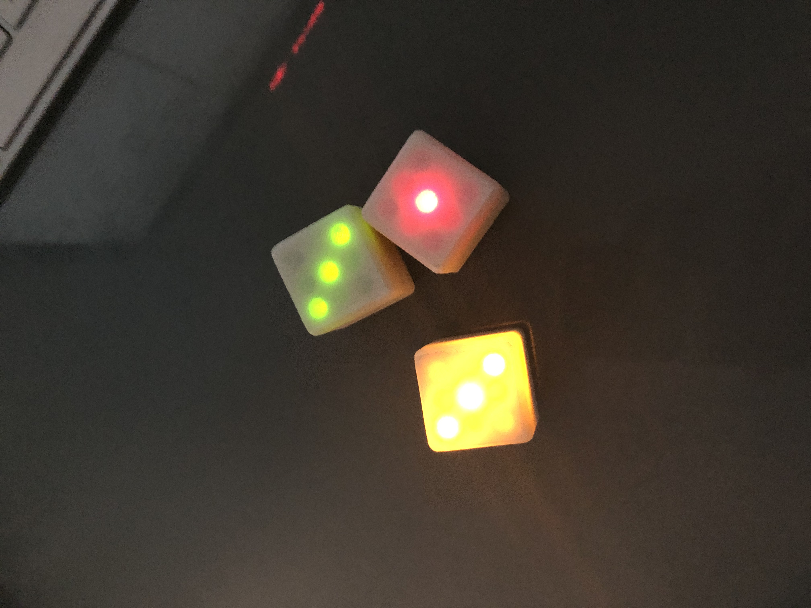

# AutodiDICE
Electronic DICE

## Objectifs :

`Création Dé electronique sur base Attiny 85 de A à Z`

Detection de vibration (switch mercure)

Mode Sleep et arret automatique après 7 secondes

Fonctionnel dans tous les sens (s'active sur un front montant du switch)

Ma Video: https://www.youtube.com/watch?v=F5hV5DrT228

3D STL Files: https://www.thingiverse.com/thing:4596834

Fichier GERBER pour production carte à souder: ???

*Développement Electronique sous EasyEDA*

*Commande de cartes JLC-PCB*

### Principales réalisations : 

```
- Developpement Soft
  - Micro controlleur Attiny 85 (Evolution en Attiny13 pour encore diminuer le prix)
  - Fonction Sleep intégrée pour limiter la consommation
  - Animation du tirage dé amusante (rotation des leds)

- Développement Electronique
  - réalisation sous EasyEDA
  - Génération image 3D (dans les fichiers joints)
  - Génération des fichiers GERBER pour lancement commande en Chine (JLC-PCB)

- Développpement boitier 3D
  - création du boitier sous Fusion 360
```

## Installation :

Attention à prévoir une petite découpe du support de pile pour laisser passer le microcontroleur

## Main components :

Attiny85: https://www.amazon.fr/Pièces-Attiny85-20PU-compatible-Arduino-A149/dp/B00OXVFD1I?pd_rd_w=Va80i&pf_rd_p=324a6047-fbee-4c30-8ff6-614657224ce8&pf_rd_r=Q6TFP13AJEMFBE4DBG9W&pd_rd_r=983145fe-9685-40ba-883b-0072b5635c12&pd_rd_wg=FvDhN&pd_rd_i=B00OXVFD1I&ref_=pd_bap_d_rp_1_11_t

Attiny13A (Evolution): https://fr.aliexpress.com/item/32751983292.html?spm=a2g0s.9042311.0.0.57206c37cBFwDP

Switch: https://fr.aliexpress.com/item/32605726248.html?spm=2114.13010708.0.0.3a996c37iu4wXC

Battery support: https://www.amazon.fr/GTIWUNG-Support-Adaptateurs-Batterie-Portables/dp/B0823WK4CN?pd_rd_w=Va80i&pf_rd_p=324a6047-fbee-4c30-8ff6-614657224ce8&pf_rd_r=Q6TFP13AJEMFBE4DBG9W&pd_rd_r=983145fe-9685-40ba-883b-0072b5635c12&pd_rd_wg=FvDhN&pd_rd_i=B0823WK4CN&ref_=pd_bap_d_rp_1_12_t

